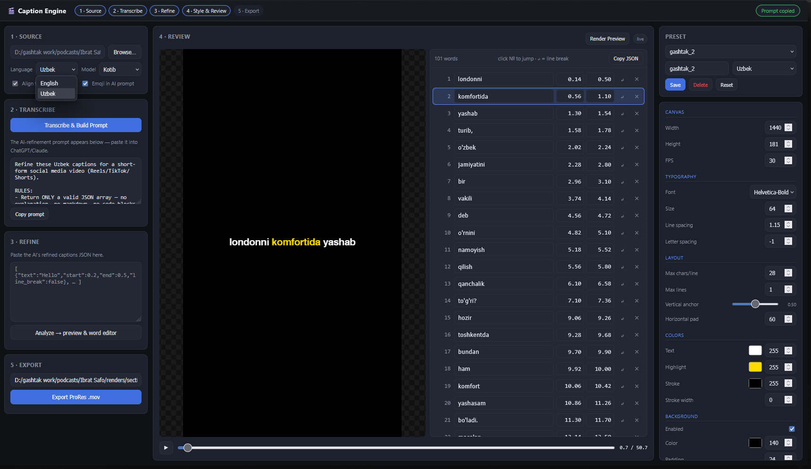
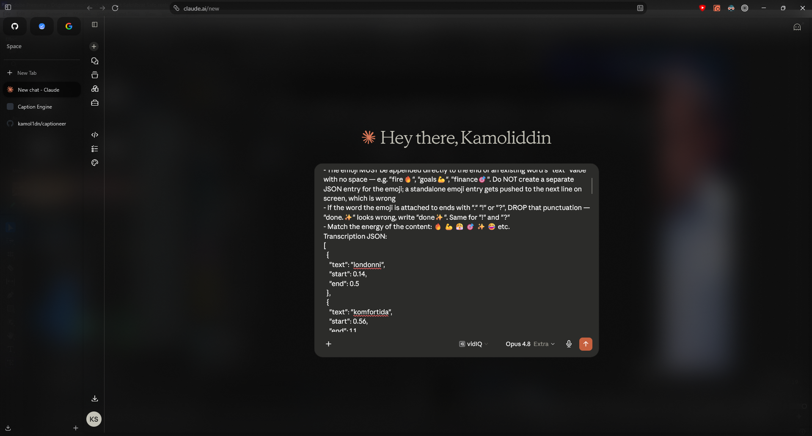
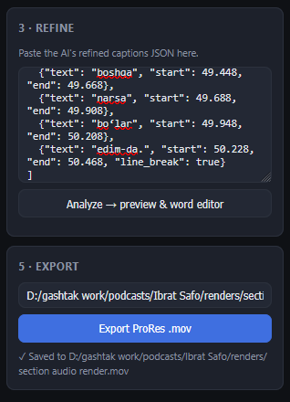
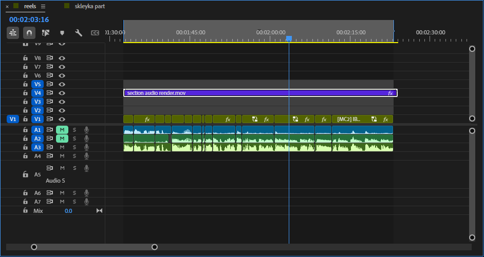
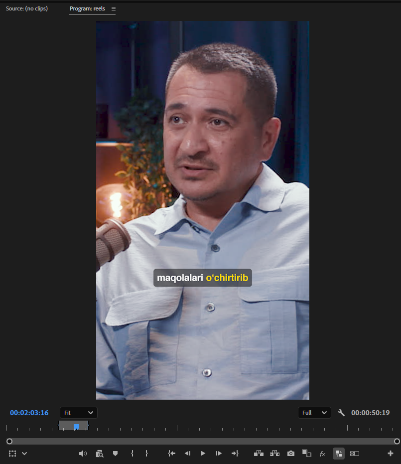

# Caption Engine

Offline, word-by-word caption generator. Produces transparent **ProRes 4444 .mov**
files you drop into Premiere / DaVinci Resolve / Final Cut as an overlay — the
kind of animated, word-highlighted captions used on Reels / TikTok / Shorts.

- **100% offline** — transcription runs locally (faster-whisper / WhisperX / Kotib)
- **Accurate word timing** via forced alignment (WhisperX for English, MMS for Uzbek)
- **Local web app** — double-click `run.bat`, work in your browser
- **Optional AI cleanup loop** — copy a prompt into ChatGPT/Claude to fix
  transcription errors, break lines, and add emoji, then paste the result back
- **English + Uzbek** — Uzbek routes to a dedicated Kotib model with proper
  o‘/g‘ digraphs and Russian code-switch handling
- **Word-level highlighting** (scale pop, color, or box), phrase fades, emoji
- **Editable style presets** — create/tweak/save your own in the UI
- **Editor-agnostic output** — alpha .mov works everywhere

Everything it needs is bundled: FFmpeg 7.1 and the fonts ship in the repo, and
`run.bat` installs Python + the AI libraries on first launch.



## Quick start (Windows, one click)

Double-click **`run.bat`**.

The first launch sets everything up automatically — installs Python 3.12,
PyTorch (GPU build if an NVIDIA card is present, CPU build otherwise), the
transcription libraries, and wires the bundled FFmpeg into place. That download
is a few GB and can take 10–30 minutes. Every launch after that skips setup and
opens the app in seconds.

When it's ready a browser tab opens at `http://127.0.0.1:8765`. Keep the black
console window open — closing it shuts the app down.

> The first time you transcribe, the speech models themselves download (another
> few GB, one time only).

## The workflow

The app walks left-to-right through five steps:

1. **Source** — pick a video or audio file (mp3/wav podcasts work too), choose
   the language and Whisper model, and toggle alignment / emoji.
2. **Transcribe & Build Prompt** — runs speech-to-text locally and produces an
   *AI-refinement prompt*.
3. **Refine** *(optional but recommended)* — paste that prompt into ChatGPT or
   Claude. The AI fixes transcription mistakes, sets line breaks at natural
   pauses, and sprinkles in emoji, then returns clean captions JSON that you
   paste back into the app. (You can also skip this and edit words by hand.)
4. **Style & Review** — pick a preset and tweak any setting live. A canvas
   preview updates instantly; **Render Preview** produces a pixel-accurate,
   low-res render through the real engine so you can trust what you'll get. The
   built-in word editor lets you fix text, retime, and set line breaks (`↵`).
5. **Export** — renders the final transparent ProRes 4444 `.mov`.

Dropping the AI step in the middle is deliberate: local Whisper nails the timing
but a big cloud model is far better at spelling, punctuation, and phrasing, so
the pipeline uses each for what it's best at.

| Paste the prompt into any chat model… | …then paste the refined JSON back and export |
| :---: | :---: |
|  |  |

## In your editor

The exported `.mov` has a real alpha channel, so it drops straight onto a track
above your footage in any NLE — no chroma key, no matte. Below, the caption
render sits on `V4` in a Premiere timeline and composites over the video in the
program monitor.

| The `.mov` on a timeline track | Composited over the footage |
| :---: | :---: |
|  |  |

## Transcription backends

`transcribe()` picks a backend automatically by language:

| Backend            | Used for                | Word timing                          |
| ------------------ | ----------------------- | ------------------------------------ |
| **WhisperX**       | English (default)       | Forced alignment, ~±20–50 ms         |
| **faster-whisper** | English, `--no-align`   | Inferred, drifts ±100–300 ms         |
| **Kotib + MMS**    | Uzbek (`language=uz`)   | MMS forced alignment                 |

WhisperX transcribes with faster-whisper and then force-aligns with a phoneme
model. If WhisperX isn't installed the engine warns and falls back to plain
faster-whisper. Kotib is a Whisper fine-tune for Uzbek text, paired with Meta's
MMS aligner for accurate word timing.

## Presets

Presets are editable and stored in `preferences.json` (created on first run,
seeded from the built-ins). Create, edit, group, and delete them right in the
UI; **Reset** restores the built-in set.

**English:** `otg_cyan` · `reels_classic` · `bold_yellow_box` · `minimal_white`
· `punchy_green`
**Uzbek:** `gashtak_2` · `gashtak_main`

Every visual knob is a field on the `CaptionStyle` dataclass — font, size,
tracking, colors, stroke, background box (with offset/scale), highlight mode
(`none`/`scale`/`box`), phrase fades, hold-across-gaps, and more.

## Command line (power users)

The GUI is the main way in, but the full pipeline is scriptable:

```bash
# Full pipeline: video -> transparent caption .mov
python -m caption_engine.cli my_reel.mp4 -o captions.mov --preset reels_classic

# Iterate on style without re-running Whisper (much faster):
python -m caption_engine.cli my_reel.mp4 --transcribe-only -j words.json
python -m caption_engine.cli --from-json words.json -o v1.mov --preset punchy_green
python -m caption_engine.cli --from-json words.json -o v2.mov --preset gashtak_main

# Preview a preset with mock words, no input file needed:
python -m caption_engine.cli --test-render --preset bold_yellow_box -o test.mov
```

Useful flags: `--model {tiny,base,small,medium,large-v3}`, `--language uz`,
`--no-align`, `--width/--height/--fps`, `--hold`.

## Python API

```python
from caption_engine import make_captions, transcribe, save_words, presets

# Easy mode
make_captions("reel.mp4", "out.mov", preset="reels_classic")

# Custom style
style = presets.reels_classic()
style.font_size = 100
style.highlight_color = (255, 100, 200, 255)   # pink
style.max_chars_per_line = 14
make_captions("reel.mp4", "out.mov", style=style)

# Cache transcription once, render many variants
words = transcribe("reel.mp4", model_size="base")
save_words(words, "words.json")
for name in ["reels_classic", "punchy_green", "bold_yellow_box"]:
    make_captions(words_json="words.json", output_mov=f"out_{name}.mov", preset=name)
```

## Long-form subtitles (`long_captions`)

A separate sidecar tool for traditional **.srt / .vtt** subtitles on long media
(lectures, podcasts) — not the word-by-word overlay style above. It reuses the
same transcription engine but slices long audio into silence-snapped windows so
Uzbek MMS alignment stays within a flat VRAM budget regardless of length.

```bash
python -m long_captions.subtitle_gen lecture.mp4 -o lecture.srt --language uz
python -m long_captions.gui        # small Tkinter front-end
```

## Architecture

```
caption_engine/
  transcriber/   Whisper/WhisperX/Kotib backends -> word-level timestamps
  layout/        group words into phrases & lines (chars, gaps, line breaks)
  style/         CaptionStyle dataclass + font discovery
  presets/       built-in style seeds
  preferences.py preferences.json store (app settings + user presets)
  prompt.py      builds the AI-refinement prompt (text in prompts.txt)
  emoji.py       shared emoji detection / font-switching
  renderer/      Pillow frames -> ffmpeg -> ProRes 4444 .mov (+ preview)
  engine.py      orchestrator (public API)
  cli.py         command-line interface
  web/           Flask app + browser UI (the default front-end)
long_captions/   long-form .srt/.vtt subtitle generator (separate tool)
ffmpeg-7.1/      bundled FFmpeg binaries
assets-fonts/    bundled Helvetica, Montserrat, Apple Color Emoji
```

Each module is independent and swappable — the transcriber, layout, and
renderer don't know about each other beyond the `Word`/`Phrase`/`CaptionStyle`
data types that pass between them.

## Manual setup (non-Windows / developers)

`run.bat` automates this on Windows. To do it by hand:

```bash
py -3.12 -m venv venv
venv/Scripts/python -m pip install -U pip
# GPU (CUDA 12.8) build of torch — plain PyPI serves CPU-only wheels:
venv/Scripts/python -m pip install torch==2.8.0 torchaudio==2.8.0 torchvision==0.23.0 \
    --index-url https://download.pytorch.org/whl/cu128
venv/Scripts/python -m pip install -r requirements.txt
```

Requires Python 3.12. FFmpeg is bundled in `ffmpeg-7.1/`; if you use your own,
put it on `PATH`. See the header of `requirements.txt` and `run.bat` for the
exact versions and the torchcodec/FFmpeg DLL wiring.

## Performance

- Transcription: ~1–2× realtime on CPU (`base` int8); much faster on GPU
- Rendering: ~30–60 fps on a modern laptop
- A 60s reel → roughly a minute end-to-end (transcribe + render)

## Roadmap

- [ ] Audio waveform-aware emphasis (louder = bigger pop)
- [ ] More built-in presets and animation styles
- [ ] Premiere / DaVinci extension that drives this engine as a backend
